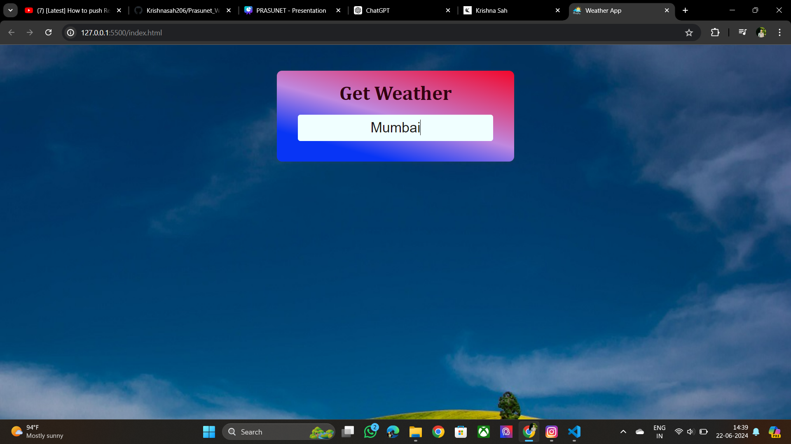

# Weather App 

## Overview

This project is a Weather App developed as part of Task 5 for the Prasunet Company Internship in Web Designing. The app allows users to search for current weather conditions in various locations worldwide. Built using HTML, CSS, and JavaScript, the app provides a user-friendly interface to display real-time weather data fetched from a weather API.

## Features

- **Search Functionality:** Users can input the name of any city to get the current weather information for that location.
- **Real-time Data:** The app fetches real-time weather data, ensuring that users receive the most up-to-date information.
- **Responsive Design:** The app is designed to be fully responsive, providing an optimal viewing experience across various devices and screen sizes.
- **Clean UI:** A minimalist and intuitive user interface that focuses on usability and clarity.

## Technologies Used

- **HTML:** Used for structuring the content and layout of the app.
- **CSS:** Applied for styling the app, including layout, colors, fonts, and responsiveness.
- **JavaScript:** Used for fetching data from the weather API and dynamically updating the UI based on user interactions.

## How to Use

1. **Open the App:** Launch the app in a web browser.
2. **Search for a City:** Enter the name of the city you wish to get the weather information for in the search bar.
3. **View Weather Data:** Press the search button, and the app will display the current weather conditions for the entered city, including temperature, weather description, humidity, and wind speed.

## API Integration

The app integrates with a weather API to fetch real-time weather data. Ensure that you have a valid API key from a weather service provider (e.g., OpenWeatherMap, WeatherAPI) and replace the placeholder in the JavaScript file with your API key.

## Folder Structure

- **index.html:** The main HTML file that structures the web app.
- **styles.css:** The CSS file containing styles for the app.
- **script.js:** The JavaScript file responsible for handling API requests and updating the DOM.
- **assets:** Folder containing any images or additional assets used in the app.

## Future Improvements

- **Extended Forecast:** Adding a feature to display a 5-day weather forecast for the searched city.
- **Geolocation Support:** Enabling the app to fetch weather data based on the user's current location.
- **Error Handling:** Improving error handling to provide user feedback when an invalid city name is entered or when there are network issues.

## Conclusion

This Weather App showcases the fundamental skills in web designing using HTML, CSS, and JavaScript. It demonstrates the ability to create a functional, aesthetically pleasing, and responsive web application that interacts with an external API. This project not only fulfills the requirements of Task 5 for the Prasunet Company Internship but also serves as a foundation for further enhancements and features.

